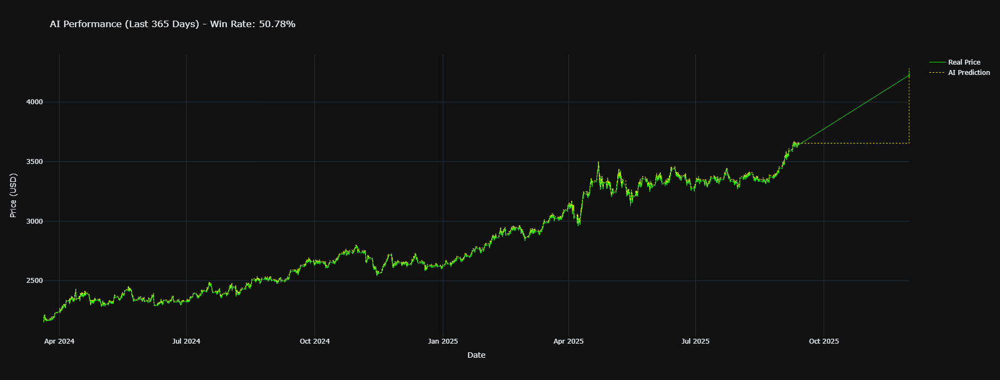

# Gold Price Prediction Using Dual-Timeframe LSTM (Big Brother / Little Brother Model)

**Created by:** Daryl James Padogdog

## 📌 Overview

This project implements a **dual-timeframe LSTM-based price prediction system for Gold (XAUUSD)** using historical market data.
The system mimics how human traders analyze the market by combining:

*   **Higher timeframe trend analysis (1H candles)**
*   **Lower timeframe entry confirmation (5-minute candles)**

To achieve this, two separate LSTM models are trained:

*   **Big Brother Model →** Identifies the overall market trend
*   **Little Brother Model →** Confirms precise trade entries

The final output is a **BUY / SELL / WAIT** trading signal based on the alignment of both models.

## 📊 Performance (Example)

During testing (last 365 days), the model achieved:
*   **Win Rate:** ~50.78%
*   **Total Operations:** 100k+ candles analyzed

### Visual Results
*   **Yellow Line:** AI Prediction (Model)
*   **Green Line:** Real Data (Market)

*(Note: Past performance is not indicative of future results.)*

# A I _ T R A D I N G _ M O D E L

## 🧠 Concept: Big Brother vs Little Brother

| Model | Name | Timeframe | Purpose |
| :--- | :--- | :--- | :--- |
| **Big Brother** | `big_brother_model.keras` | 1 Hour | Determines overall market trend (Bullish / Bearish) |
| **Little Brother** | `little_brother_model.keras` | 5 Minutes | Confirms short-term entry or exit signals |

**The system only enters trades when both timeframes agree, reducing false signals and improving decision reliability.**

## 📂 Configuration

*   **Training Data:**
    *   `XAU_1h_data.csv` (1-Hour Data)
    *   `XAU_5m_data.csv` (5-Minute Data)
*   **Lookback Periods:**
    *   Big Brother: 720 candles
    *   Little Brother: 48 candles

## 🚀 Usage

The project is structured as a Jupyter Notebook (`Trading_AI_model .ipynb`) that:
1.  Loads and preprocesses data.
2.  Trains both LSTM models.
3.  Performs a live trading simulation.
4.  Backtests performance over the last 365 days.

