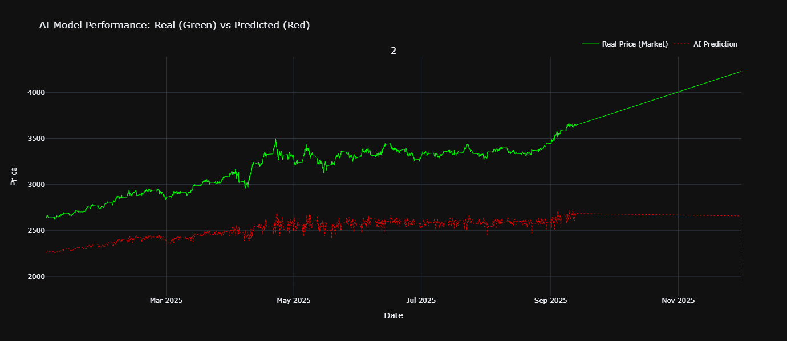
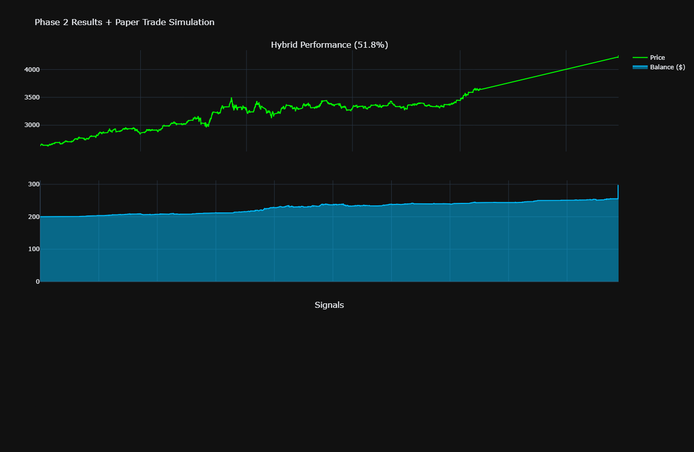
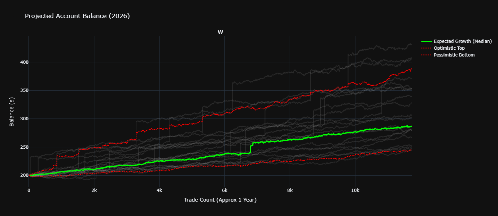

# Gold Price Prediction V2 (Improved Dual-Timeframe LSTM)

**Created by:** Daryl James Padogdog
<br>
<br>

<video src="images/TRADE_WEEKLY_WINRATE.mp4" controls="controls" style="max-width: 100%;">
</video>
<br>
<br>

<<<<<<< HEAD
# if video did not show up
 * go to this directory "images/TRADE_WEEKLY_WINRATE.mp4" and open it with any video player

<br>
=======
# if video did not apear go to the images file 
* TRADE_WEEKLY_WINRATE.mp4 *
>>>>>>> 9642d9cfd39761e1ab30759388b908df32249ed5
<br>


## 📌 Overview
This project implements an **improved dual-timeframe LSTM-based price prediction system for Gold (XAUUSD)**.
It significantly enhances the original model by incorporating **technical indicators, efficient memory management, and a robust 2025 Out-of-Sample testing strategy**.

The system mimics human trading by combining:
*   **Higher timeframe trend analysis (1H candles)**
*   **Lower timeframe entry confirmation (5-minute candles)**

## 🚀 Key Improvements in V2

| Feature | Original (V1) | Improved (V2) |
| :--- | :--- | :--- |
| **Features** | 1 (Close Price) | **17 Features** (OHLCV + Technical Indicators) |
| **Architecture** | Simple LSTM | **Bidirectional LSTM + Global Pooling** |
| **Memory** | High (float64) | **Efficient (float32 + Garbage Collection)** |
| **Risk Management** | None | **1% SL / 2% TP** |
| **Validation** | Random Split | **Strict 2025 Out-of-Sample Test** |

## 🧠 Model Architecture

Two separate models work in tandem:
1.  **Big Brother (`big_brother_v2.keras`)**: Analyzes 1-week of 1H data (168 candles) to determine the macro trend.
2.  **Little Brother (`little_brother_v2.keras`)**: Analyzes 4-hours of 5m data (48 candles) for entry confirmation.

**Technical Indicators Used:**
- RSI (14)
- MACD (12, 26, 9)
- Bollinger Bands (20, 2)
- ATR (14)
- EMA (20, 50)
- Volatility

## 📊 Performance & Visualization

### AI Model Performance (Dual-Timeframe)
The graph below demonstrates the model's prediction capabilities against real market data.


### 📊 Key Performance Metrics
*   **Win Rate / Accuracy:** 51.76%
*   **Total Operations:** 49,396 candles analyzed
*   **Confirmed Trades:** 11,734
*   **Total Wins:** 6,073
*   **Total Losses:** 5,661
*   **Estimated Return:** 48.24% (Compounded)

### Wealth Simulation (Paper Trading)
A Monte Carlo simulation projecting the growth of **$200** initial capital based on the model's historical win rate and risk parameters.




### Future Outlook (2026-2027)
**2026 Projection:**
*   **Projected Median:** $301.47 (Likely Outcome)
*   **Optimistic (90%):** $372.55 (Possible Upside)
*   **Pessimistic (10%):** $245.24 (Conservative Estimate)
Projected trend analysis for XAU/USD for the upcoming years.


## 📂 Configuration & Data Strategy

**Training Data:**
- `TRAIN_1h.csv`: 1-Hour historical data (2024 and earlier)
- `TRAIN_5m.csv`: 5-Minute historical data (2024 and earlier)

**Testing Data (2025 Out-of-Sample):**
- `TEST_1h.csv`: 2025 1-Hour data
- `TEST_5m.csv`: 2025 5-Minute data

**Performance is evaluated strictly on unknown 2025 data to ensure reliability.**

## 🛠️ Usage

### Option 1: Google Colab (Recommended)
1.  Upload `Trading_AI_model_V2.py` (or individual training scripts) to your Colab session.
2.  Upload the 4 CSV files (`TRAIN_1h.csv`, `TRAIN_5m.csv`, `TEST_1h.csv`, `TEST_5m.csv`).
3.  Run the script:
    ```bash
    python Trading_AI_model_V2.py
    ```

### Option 2: Local Execution
Ensure you have the required libraries installed:
```bash
pip install pandas numpy tensorflow scikit-learn plotly
python Trading_AI_model_V2.py
```

## 📊 Evaluation Metrics
The V2 model outputs a comprehensive dashboard (`trading_performance_v2.html`) including:
- **Win Rate %**
- **Profit Factor** (Gross Profit / Gross Loss)
- **Sharpe Ratio** (Risk-adjusted return)
- **Maximum Drawdown %**
